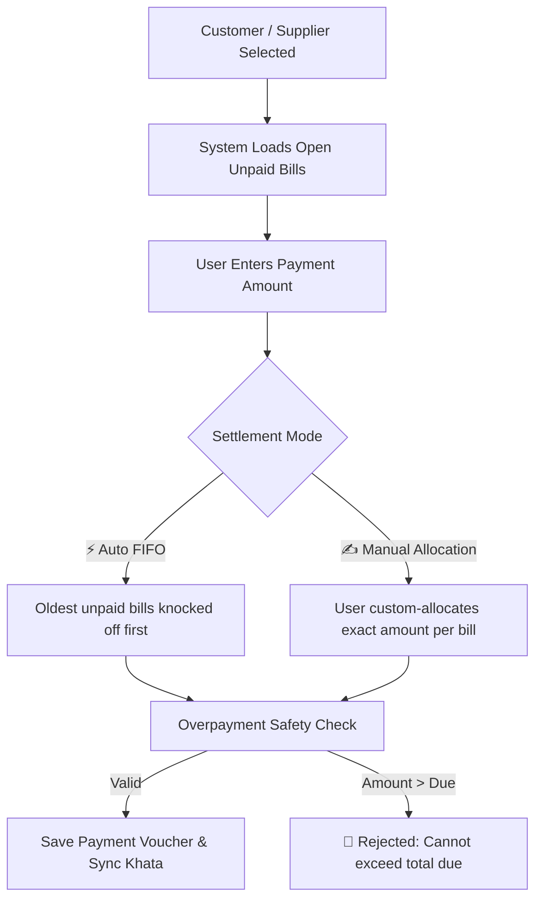

# 📘 WorkSpace Inventory & Khata Bahi — Complete Feature & User Guide

Welcome to the comprehensive user manual and feature guide for **WorkSpace Inventory & Khata Bahi SaaS**. This document details every single feature in the system, explaining **what it is**, **why it matters**, and **step-by-step instructions on how to use it**.

---

## 📑 Table of Contents

1. [System Architecture & Navigation Map](#1-system-architecture--navigation-map)
2. [Authentication & Role-Based Access Control (RBAC)](#2-authentication--role-based-access-control-rbac)
3. [Products & Inventory Catalog Management](#3-products--inventory-catalog-management)
4. [Warehouses & Multi-Godown Storage](#4-warehouses--multi-godown-storage)
5. [Stock In / Stock Out & Commercial Adjustments](#5-stock-in--stock-out--commercial-adjustments)
6. [GST Sales Invoicing, Purchase Billing & Quotations](#6-gst-sales-invoicing-purchase-billing--quotations)
7. [Customer Directory & Receivables Khata](#7-customer-directory--receivables-khata)
8. [Supplier Directory & Payables Khata](#8-supplier-directory--payables-khata)
9. [Outstandings & Aging Analysis](#9-outstandings--aging-analysis)
10. [Bill-Wise Payments & Knockoff Engine (FIFO & Manual Allocation)](#10-bill-wise-payments--knockoff-engine-fifo--manual-allocation)
11. [Financial Safety & Overpayment Prevention](#11-financial-safety--overpayment-prevention)
12. [Khata Bahi (Party Ledger Statements & Printing)](#12-khata-bahi-party-ledger-statements--printing)
13. [Executive Financial KPIs & Daily Cashflow Analytics](#13-executive-financial-kpis--daily-cashflow-analytics)
14. [Outside Cash Flow & Balance Adjustments](#14-outside-cash-flow--balance-adjustments)
15. [Finance Master — Cash & Multi-Bank Management](#15-finance-master--cash--multi-bank-management)
16. [Initial Working Capital & Solvency Metrics](#16-initial-working-capital--solvency-metrics)
17. [Vouchers History & Multi-Type Filtering](#17-vouchers-history--multi-type-filtering)
18. [Enriched Stock Movement Ledger & Valuation Metrics](#18-enriched-stock-movement-ledger--valuation-metrics)
19. [End-to-End Practical How-To Guides](#19-end-to-end-practical-how-to-guides)

---

## 1. System Architecture & Navigation Map

WorkSpace Inventory is built as a **multi-tenant enterprise SaaS platform** with strict tenant data isolation, sub-ledger accounting, and real-time inventory synchronization.

### 🌐 Module Sitemap

| Page / Route | Purpose | Key Actions |
|---|---|---|
| [`index.html`](file:///c:/Users/moham/OneDrive/Desktop/imp/work%20company/src/frontend/html/index.html) | Secure Login & SaaS Gateway | Login, Tenant Context Switching, Session Management |
| [`dashboard.html`](file:///c:/Users/moham/OneDrive/Desktop/imp/work%20company/src/frontend/html/dashboard.html) | Super Admin Platform Console | Multi-Tenant Metrics, Cross-Tenant Switcher, MRR Analytics |
| [`company-dashboard.html`](file:///c:/Users/moham/OneDrive/Desktop/imp/work%20company/src/frontend/html/company-dashboard.html) | Company Workspace Hub | Workspace Navigation Cards, Profile, Team Controls |
| [`inv-dashboard.html`](file:///c:/Users/moham/OneDrive/Desktop/imp/work%20company/src/frontend/html/inv-dashboard.html) | Inventory & Retail Dashboard | Stock KPIs, Retail Trading Bills, Liquidity Summary, Outside Cash Flow |
| [`inv-invoice.html`](file:///c:/Users/moham/OneDrive/Desktop/imp/work%20company/src/frontend/html/inv-invoice.html) | Sales Invoicing & Billing | GST Sales Invoices, Purchase Bills, Quotations, Barcode Scanner, Print |
| [`inv-products.html`](file:///c:/Users/moham/OneDrive/Desktop/imp/work%20company/src/frontend/html/inv-products.html) | Product Catalog & Live Stock | Add Product, SKU/Barcode Auto-Gen, Quick Stock (+/-), Batch Tracking |
| [`inv-customers.html`](file:///c:/Users/moham/OneDrive/Desktop/imp/work%20company/src/frontend/html/inv-customers.html) | Customer Directory & CRM | Add Customer, GSTIN / Address, Credit Terms, Receivables Khata |
| [`inv-suppliers.html`](file:///c:/Users/moham/OneDrive/Desktop/imp/work%20company/src/frontend/html/inv-suppliers.html) | Supplier / Vendor Directory | Add Supplier, Bank Details, Payment Terms, Payables Khata |
| [`inv-outstandings.html`](file:///c:/Users/moham/OneDrive/Desktop/imp/work%20company/src/frontend/html/inv-outstandings.html) | Outstandings & Aging Analysis | Receivables & Payables Aging Brackets (0-30, 31-60, 61-90, 90+ days) |
| [`inv-payments.html`](file:///c:/Users/moham/OneDrive/Desktop/imp/work%20company/src/frontend/html/inv-payments.html) | Payments, Khata Bahi & Vouchers | Receive Payment, Pay Supplier, FIFO Knockoff, Statements, Reminders |
| [`inv-finance.html`](file:///c:/Users/moham/OneDrive/Desktop/imp/work%20company/src/frontend/html/inv-finance.html) | Finance Master & Multi-Bank | Cash in Hand, Unlimited Bank Accounts, Contra Transfers, Money Flow |
| [`inv-reports.html`](file:///c:/Users/moham/OneDrive/Desktop/imp/work%20company/src/frontend/html/inv-reports.html) | Reports & Stock Valuation | FIFO/Weighted Average Valuation, 11-Col Stock Movement Ledger |

### 🧭 Modern Accounting SaaS Navigation Sidebar

All inventory modules feature a standardized vertical navigation sidebar controlled by `sidebar.js`:
1. **Split-Pill Quick Create Action**:
   - **Primary Action (Left)**: Instantly navigates to **`+ Create Sales Invoice`** ([`inv-invoice.html`](file:///c:/Users/moham/OneDrive/Desktop/imp/work%20company/src/frontend/html/inv-invoice.html)).
   - **Flyout Menu (Right Arrow)**: 1-click creation shortcuts:
     - 📄 Sales Invoice
     - 📥 Purchase Bill
     - 📝 Quotation / Estimate
     - 💵 Payment In (Receipt)
     - 💸 Payment Out (Voucher)
     - 📦 Add New Item
2. **Plans and Pricing Banner**:
   - Features an amber-gold gradient with a crown icon (`👑`), offering immediate navigation to subscription upgrades and invoice history.
3. **Structured Accordion Navigation**:
   - Organized under `GENERAL` with collapsible groups:
     - **Parties**: Customers (`inv-customers.html`) & Suppliers (`inv-suppliers.html`)
     - **Items**: Inventory Items & Catalog (`inv-products.html`)
     - **Sales**: Invoices (`inv-invoice.html`), Quotations, Collections (`inv-payments.html?tab=vouchers&type=INVOICE`)
     - **Purchases**: Purchase Bills (`inv-invoice.html`), Vendor Payments (`inv-payments.html?tab=vouchers&type=BILL`)
     - **Reports**: Bills & Ledger (`inv-payments.html?tab=vouchers`), Outstandings & Aging (`inv-outstandings.html`), Stock Summary (`inv-reports.html`), Bank & Cash Accounts (`inv-finance.html`)
   - Highlights the current route in a glowing **solid indigo pill (`#3949ab`)**.
   - Auto-expands the appropriate accordion group based on URL path and parameters (`?tab=...`).
4. **Dynamic System Navigation Footer**:
   - **`← Back to Main`** (`#main-nav-link`): Intelligently routes Super Admins back to the Platform Overview (`dashboard.html`) and Company Admins/Staff to their workspace hub (`company-dashboard.html`).
   - **`Sign Out`** (`#logout-btn`): Displays a confirmation dialog, flushes `localStorage` credentials, and safely redirects to `index.html`.
5. **Trust Badges**:
   - Displays persistent **`100% Secure`** and **`ISO Certified`** compliance badges.

---

## 2. Authentication & Role-Based Access Control (RBAC)

### 🔑 What It Is
Every user belongs to a specific company/tenant. Access is gated by permissions mapped to specific organizational roles.

### 👥 System Roles

* **`super_admin`**: Full system control across tenants and billing.
* **`company_admin`**: Full administrative access within the tenant (manage users, inventory, billing, settings).
* **`inventory_manager`**: Can create/edit products, manage godowns, and record stock movements.
* **`accountant`**: Manages payments, invoices, bills, party statements, and financial reports.
* **`warehouse_staff`**: Performs daily Stock In and Stock Out adjustments.
* **`sales_executive`**: Manages customers and creates sales stock-out entries.
* **`viewer`**: Read-only access to catalogs and reports.

### 📋 How to Use
1. Open [`index.html`](file:///c:/Users/moham/OneDrive/Desktop/imp/work%20company/src/frontend/html/index.html).
2. Enter your Email (e.g., `admin@apexretail.in` or `admin@acme.com`) and Password (`Password@123`).
3. Click **Sign in to WorkSpace**. The JWT token is securely saved in `localStorage` and sent with all API requests.

---

## 3. Products & Inventory Catalog Management

### 📦 What It Is
The central master database for all inventory items, supporting standard retail, wholesale, batch-tracked, and perishable goods.

### ⚙️ Product Specifications
* **SKU / Barcode**: Unique identification code for scanning and tracking. Auto-generation available.
* **Category & Unit**: Classification (e.g., Electronics, Hardware) and measuring unit (`Pcs`, `Kg`, `Box`, `Mtr`).
* **Pricing Levels**: MRP (Maximum Retail Price), Purchase Rate (Cost Price), and Default Selling Price.
* **Indian Tax Compliance**: HSN Code and GST Rate percentage (`0%`, `5%`, `12%`, `18%`, `28%`).
* **Inventory Control**: Reorder Threshold Alert (highlights items that are running low).
* **Tracking Modes**: `STANDARD` (quantity only) or `BATCH` (supports Batch Numbers and Expiry Dates).

### 📋 How to Use
1. Navigate to **Inventory Catalog** ([`inv-products.html`](file:///c:/Users/moham/OneDrive/Desktop/imp/work%20company/src/frontend/html/inv-products.html)).
2. Click **➕ Add Product**.
3. Fill in the product details:
   * **Name**: e.g., `HDMI Cable 1.5m`
   * **SKU**: e.g., `ELEC-HDMI-15` (or click Auto-Gen)
   * **Category & Unit**: Select from universal dropdowns.
   * **Purchase Rate & Selling Price**: Enter prices (e.g., ₹250 purchase, ₹499 selling).
   * **GST Rate**: Select tax bracket (e.g., `18%`).
   * **Reorder Level**: e.g., `20` (system warns when total stock drops below 20).
4. Click **Save Product**.

---

## 4. Warehouses & Multi-Godown Storage

### 🏭 What It Is
Multi-location inventory tracking across central warehouses, regional godowns, distribution hubs, and retail stores.

### 📋 How to Use
1. Godowns and warehouses are managed in the system database and available in dropdown selectors throughout the inventory suite.
2. In **Quick Stock** or **Sales Invoicing**, select the specific **Warehouse / Godown** (`Main Godown - Bhiwandi`, `Regional Hub - Pune`, etc.) from the warehouse dropdown.
3. Live stock across all warehouses is automatically summed on the products page and tracked per-warehouse in the Stock Ledger ([`inv-reports.html`](file:///c:/Users/moham/OneDrive/Desktop/imp/work%20company/src/frontend/html/inv-reports.html)).

---

## 5. Stock In / Stock Out & Commercial Adjustments

### ⚡ What It Is
A unified transaction engine that updates physical stock counts in real time while optionally generating commercial accounting documents (**Invoices** for Customers or **Purchase Bills** for Suppliers).

### 🔄 Movement Types

#### 1. Stock In (`+`) — Purchase / Restocking
* Increases inventory count in the selected godown.
* If a **Supplier** is attached:
  * Creates a **Supplier Purchase Bill** (`BILL-YYYY-XXXX`).
  * If marked **Unpaid / Credit**: Adds to Supplier Payables.
  * If marked **Paid / Partial**: Records immediate `PAYMENT_OUT` voucher and updates remaining bill balance.

#### 2. Stock Out (`-`) — Sales / Dispatch
* Decreases inventory count after validating sufficient stock.
* If a **Customer** is attached:
  * Creates a **Tax Sales Invoice** (`INV-YYYY-XXXX`).
  * If marked **Unpaid / Credit**: Adds to Customer Receivables.
  * If marked **Paid / Partial**: Records immediate `PAYMENT_IN` voucher and updates remaining invoice balance.

### 📋 How to Use (Quick Stock)
1. On **Products Page** ([`inv-products.html`](file:///c:/Users/moham/OneDrive/Desktop/imp/work%20company/src/frontend/html/inv-products.html)), find any product and click **⚡ Stock**.
2. Select **Movement Type**:
   * `Stock In (+)` for receiving inventory from a vendor.
   * `Stock Out (-)` for selling/dispatching inventory to a buyer.
3. Select the **Warehouse / Godown**.
4. Enter **Quantity** and **Unit Rate**.
5. *(Optional Batch Tracking)* If enabled on product, enter **Batch Number** and **Expiry Date**.
6. Under **Commercial Billing**:
   * Select the **Supplier** or **Customer**.
   * Review Total Bill Amount (auto-calculated with GST).
   * Choose **Payment Status**:
     * `Credit / Unpaid`: Bill remains open for future settlement.
     * `Full Paid`: Creates voucher immediately; balance = ₹0.
     * `Partial Paid`: Enter initial payment amount (e.g. ₹5,000); remaining balance stays open.
7. Click **Apply & Save**. Stock count, ledger entry, and billing records update simultaneously.

---

## 6. GST Sales Invoicing, Purchase Billing & Quotations

### 🧾 What It Is ([`inv-invoice.html`](file:///c:/Users/moham/OneDrive/Desktop/imp/work%20company/src/frontend/html/inv-invoice.html))
A dedicated document generator for creating compliant Indian commercial invoices, purchase bills, and quotations with itemized GST taxes.

### ⚙️ Capabilities
- **Document Type Modes**: Toggle between `Sales Invoice`, `Purchase Bill`, and `Quotation / Estimate`.
- **Party Selection**: Auto-populates customer or supplier details, phone numbers, state codes, and GSTIN via the unified party loader.
- **Line Items & Calculations**:
  - Live product search with automatic price, unit, HSN, and GST rate auto-fill.
  - Line-level discounts (percentage or fixed amount).
  - Multi-tier GST calculation (CGST + SGST for intra-state or IGST for inter-state transactions).
- **Payment Terms & Due Dates**: Built-in terms selector (Immediate, Net 15, Net 30, Net 60) dynamically setting payment due dates.
- **Print & Spreadsheet Export**:
  - **🖨️ Print Tax Invoice**: Produces a clean, formatted physical invoice layout.
  - **📊 Spreadsheet Preview**: Uses the universal spreadsheet viewer for instant tabular inspection.

---

## 7. Customer Directory & Receivables Khata

### 👥 What It Is ([`inv-customers.html`](file:///c:/Users/moham/OneDrive/Desktop/imp/work%20company/src/frontend/html/inv-customers.html))
Complete buyer profile management including GST compliance, credit terms, credit limits, and real-time receivable tracking.

### 📋 Key Fields
* **Business Name & Contact Person**
* **GSTIN & State Code** (used for B2B tax compliance)
* **Payment Terms (Credit Days)**: e.g., 15 Days (triggers automatic overdue aging)
* **Credit Limit (₹)**: Maximum credit exposure allowed for this customer.
* **Billing & Shipping Address**

### 📋 How to Use
1. Open **Customers** ([`inv-customers.html`](file:///c:/Users/moham/OneDrive/Desktop/imp/work%20company/src/frontend/html/inv-customers.html)).
2. Click **➕ Add Customer**.
3. Fill in Customer Name, Phone, Email, GSTIN, and Credit Terms.
4. Click **Save Customer**.

---

## 8. Supplier Directory & Payables Khata

### 🏭 What It Is ([`inv-suppliers.html`](file:///c:/Users/moham/OneDrive/Desktop/imp/work%20company/src/frontend/html/inv-suppliers.html))
Vendor master directory storing payment terms, bank account details (for NEFT/RTGS payouts), and outstanding payable balances.

### 📋 How to Use
1. Open **Suppliers** ([`inv-suppliers.html`](file:///c:/Users/moham/OneDrive/Desktop/imp/work%20company/src/frontend/html/inv-suppliers.html)).
2. Click **➕ Add Supplier**.
3. Enter Vendor Name, Contact Info, GSTIN, Payment Terms (e.g. 30 Days), and Bank Details (Account No, IFSC, Bank Name).
4. Click **Save Supplier**.

---

## 9. Outstandings & Aging Analysis

### ⏳ What It Is ([`inv-outstandings.html`](file:///c:/Users/moham/OneDrive/Desktop/imp/work%20company/src/frontend/html/inv-outstandings.html))
A specialized executive dashboard monitoring credit exposure and pending receivables and payables across time brackets.

### 📊 Key Metrics & Aging Brackets
- **Total Receivables (Customer Lena)**: All pending trade balances owed by customers.
- **Total Payables (Supplier Dena)**: All pending bills owed to vendors.
- **Aging Brackets**: Breaks down debts into standard commercial timeframes:
  - `0 – 30 Days` (Current credit period)
  - `31 – 60 Days` (Overdue)
  - `61 – 90 Days` (Severe delay)
  - `90+ Days` (Critical / High risk)
- **Direct Actions**:
  - 1-click **WhatsApp Reminder** dispatch for overdue debtors with prefilled bilingual messages.
  - Direct **Khata Statement** link to view complete double-entry transaction history.

---

## 10. Bill-Wise Payments & Knockoff Engine (FIFO & Manual Allocation)

### 💰 What It Is ([`inv-payments.html`](file:///c:/Users/moham/OneDrive/Desktop/imp/work%20company/src/frontend/html/inv-payments.html))
A professional dual-mode settlement engine for recording money received from customers or paid to suppliers.

### ⚙️ How It Works



### ⚡ Settlement Modes

1. **⚡ Auto-Knockoff (FIFO)**:
   * Click the **⚡ Auto-Knockoff (FIFO)** button.
   * The algorithm automatically allocates funds against the oldest unpaid invoices/bills first until the payment amount is exhausted.
   * Partial settlements are applied to the active bill, leaving the exact remaining balance displayed.

2. **✍️ Manual Allocation**:
   * Type exact amounts into the **Allocate (₹)** inputs next to specific bill rows.
   * The remaining bill balance updates live in green (`₹0` when cleared) or blue (remaining balance).

3. **💳 Supported Payment Modes**:
   * **📱 UPI**: Captures 12-digit UTR / RRN (GPay, PhonePe, Paytm, BHIM).
   * **🏦 NEFT / RTGS / IMPS**: Captures Bank Transaction UTR.
   * **📝 Cheque**: Captures 6-digit Cheque Number & Bank Name.
   * **💵 Cash**: Captures Cash Receipt Reference with Section 269ST statutory compliance check.
   * **🌐 Net Banking**: Captures Net Banking Reference ID.

### 📋 How to Record a Payment / Receipt
1. Open **Payments & Khata Bahi** ([`inv-payments.html`](file:///c:/Users/moham/OneDrive/Desktop/imp/work%20company/src/frontend/html/inv-payments.html)).
2. Click **➕ Record Payment** (or click **💵 Receive** / **💸 Pay** on any row).
3. Select **Party Type** (`Customer` or `Supplier`) and select the **Party Name**.
4. The system immediately loads:
   * Total outstanding due.
   * Table of open unpaid bills with voucher numbers, dates, and pending amounts.
5. Enter **Total Payment Amount (₹)**.
6. Choose settlement method:
   * Click **⚡ Auto-Knockoff (FIFO)** for automatic priority settlement.
   * OR enter custom allocation amounts in the bill table.
7. Select **Payment Mode** and enter **UTR / Reference Number** (or click Auto-Gen).
8. Click **Save & Update Khata**.

---

## 11. Financial Safety & Overpayment Prevention

### 🛡️ What It Is
Hard financial validation barriers preventing data corruption, negative balances, and erroneous cash entries.

### 🔒 Active Safeguards

1. **Party Total Due Cap**: You cannot enter or submit a payment amount greater than the party's total outstanding balance.
2. **Zero-Balance Block**: If a party is already `CLEARED` (₹0 due), recording further payments is blocked.
3. **Bill-Level Allocation Cap**: You cannot allocate more money to an individual bill than its remaining pending amount.
4. **Total Allocation Consistency**: The sum of all manual bill allocations cannot exceed the total payment amount.
5. **Stock Adjustment Overpayment Block**: When recording partial payments during Quick Stock, `paidAmount` cannot exceed `totalAmount`.
6. **Live UI Alerts**: Instant red highlight and warning message if an entered value exceeds allowable limits.

---

## 12. Khata Bahi (Party Ledger Statements & Printing)

### 📜 What It Is
An authentic digital replica of the traditional Indian **खाता बही (Khata Bahi)** ledger, showing running debit/credit balances for any customer or supplier.

### 📊 Statement Columns
* **Date**: Transaction timestamp.
* **Voucher #**: Clickable voucher identifier (`INV-...`, `BILL-...`, `REC-...`, `PAY-...`).
* **Transaction Type**: Invoices, Bills, Receipts, Payments, Opening Balances.
* **Payment Mode / Reference**: UPI UTR, NEFT Reference, Cheque Number.
* **Debit (₹)**: Value charged / paid out.
* **Credit (₹)**: Value billed / received in.
* **Running Balance (₹)**: Net position after each entry with Dr/Cr status.

### 📋 How to View & Print Statement
1. In [`inv-payments.html`](file:///c:/Users/moham/OneDrive/Desktop/imp/work%20company/src/frontend/html/inv-payments.html), click **📜 Statement** next to any customer or supplier.
2. Filter by date range if desired (From Date — To Date).
3. Review total debits, total credits, and net closing balance.
4. Click **🖨️ Print Statement** for a clean, print-optimized statement suitable for sharing with clients or accountants.

---

## 13. Executive Financial KPIs & Daily Cashflow Analytics

### 📈 What It Is
Real-time dashboard cards providing immediate visibility into company liquidity, credit risk, and daily collections.

### 🎯 Key Performance Indicators (KPIs)

* **Total Receivables (₹)**: Total money owed to your company by customers across all open invoices.
* **Total Payables (₹)**: Total money your company owes to suppliers across all open purchase bills.
* **Overdue Receivables (₹)**: Value of customer invoices that have passed their credit terms / due date.
* **Net Working Capital (₹)**: Net operational balance (`Initial Working Capital + Total Receivables − Total Payables`).
* **Cash in Hand (₹)**: Store physical cash drawer net position (`Cash Inflows − Cash Outflows`).
* **Bank / UPI Balance (₹)**: Net liquid capital in corporate bank accounts, UPI VPAs, and digital gateways.

### 📅 Daily Payment & Cashflow Tracker
* Aggregates collections (Inflow) and vendor disbursements (Outflow) per day for the last 30 days.
* Displays mode-wise distribution (UPI vs NEFT vs Cash vs Cheque).
* Displays Net Daily Cashflow (`Inflow − Outflow`), incorporating both commercial trading and outside cashflow entries.

---

## 14. Outside Cash Flow & Balance Adjustments

### ⚡ What It Is
Allows merchants, store managers, and admins to **add to (+ Inflow)** or **subtract from (- Outflow)** store cash and bank balances without distorting commercial trade sales or purchase ledger outstandings.

### 📂 Supported Non-Trading Categories

| Flow Direction | Purpose | Supported Categories | Target Liquidity Impact |
| :--- | :--- | :--- | :--- |
| ➕ **Add to Balance** <br>*(Outside Inflow)* | Capital injection or non-commercial cash in | • **Owner / Partner Capital Injection** (`CAPITAL_INJECTION`)<br>• **Loan / Borrowing Inflow** (`LOAN_RECEIVED`)<br>• **Other Income / Inflow** (`OTHER_INFLOW`) | Increases **Cash in Hand** or **Bank / UPI** balance |
| ➖ **Subtract from Balance** <br>*(Outside Outflow)* | Drawings, overheads, or non-commercial cash out | • **Owner Drawings / Personal Drawings** (`OWNER_DRAWINGS`)<br>• **Store / Office Rent & Utilities** (`RENT_AND_UTILITIES`)<br>• **Staff Salary & Wages** (`SALARY_AND_WAGES`)<br>• **Office & Store Expenses** (`OFFICE_EXPENSES`)<br>• **Loan Repayment / EMI** (`LOAN_REPAYMENT`)<br>• **Bank Charges & Processing Fee** (`BANK_CHARGES_TAX`)<br>• **Other Outflow** (`OTHER_OUTFLOW`) | Decreases **Cash in Hand** or **Bank / UPI** balance |

### 📋 How to Use
1. On the **Inventory Dashboard** ([`inv-dashboard.html`](file:///c:/Users/moham/OneDrive/Desktop/imp/work%20company/src/frontend/html/inv-dashboard.html)) or **Payments Screen** ([`inv-payments.html`](file:///c:/Users/moham/OneDrive/Desktop/imp/work%20company/src/frontend/html/inv-payments.html)), click **`⚡ Outside Cash Flow / Adjust Balance`**.
2. Select **➕ Add to Balance** (green) or **➖ Subtract from Balance** (red).
3. Choose the target account: **💵 Cash in Hand** or **🏛️ Bank / UPI**.
4. Enter the amount to view the **Live Impact Preview** (e.g., `+₹50,000 will be ADDED to Cash in Hand as Outside Inflow`).
5. Select category, transaction date, particulars / entity name, and reference/UTR number.
6. Click **✓ Record Outside Flow**. The account balances and daily cashflow will update immediately.

---

## 15. Finance Master — Cash & Multi-Bank Management

### 🏦 What It Is ([`inv-finance.html`](file:///c:/Users/moham/OneDrive/Desktop/imp/work%20company/src/frontend/html/inv-finance.html))
The **Finance Master** provides dedicated treasury control across **Physical Cash in Hand** and **Unlimited Simulated Bank Accounts** (e.g., HDFC Current A/C, ICICI Payout A/C, SBI Operating A/C). It features real-time money flow tracking to trace exactly **whose money was received by which bank account or cash register**.

> [!NOTE]
> **Simulated Treasury / Internal Bookkeeping**: All bank accounts in WorkSpace are virtual bookkeeping ledger accounts managed entirely within your ERP database. No live bank net-banking credentials or third-party Open Banking API connections are required.

### 💼 Key Capabilities
1. **Multiple Simulated Bank Accounts Management**:
   - Register unlimited business bank accounts with Bank Name, Account Number, Account Type (`CURRENT`, `SAVINGS`, `OVERDRAFT`, `VIRTUAL`), IFSC Code, Branch Name, and UPI IDs.
   - Quick preset sample buttons (`HDFC`, `ICICI`, `SBI`, `AXIS`) for 1-click simulation setup.
   - Live Available Balance calculated automatically: $\text{Opening Balance} + \text{Credits (Inflows)} - \text{Debits (Outflows)}$.
   - Visual bank cards with copyable account numbers, primary default badges, and one-click filtering.
2. **Physical Cash Management**:
   - Track physical cash drawer balance and today's cash velocity.
   - Quick Cash Actions: Receive Outside Cash (`+`), Record Petty Expenses (`-`), Deposit Cash into Bank (`Contra`), and Withdraw Cash from Bank (`Contra`).
3. **Contra Fund Transfers**:
   - Seamless double-entry transfers between Cash and Bank (`CASH_DEPOSIT_BANK`, `CASH_WITHDRAWAL_BANK`) or between two registered Bank Accounts (`INTER_BANK_TRANSFER`).
   - Generates sequential contra vouchers (`DEP`, `WTH`, `TXF`) keeping both source and destination ledgers perfectly balanced.
4. **Real-Time Money Flow Tracking (खाता बही)**:
   - Identifies exact source (`From: Customer / Owner / Cash / Source Bank`) and destination (`To: Target Bank Account / Supplier / Expense / Cash Register`).
   - Color-coded badges: 🟢 Money In (Credit), 🔴 Money Out (Debit), 🔄 Contra Transfer.
   - Reference and UTR number tracking for banking reconciliation.

### 📋 How to Use
1. In the sidebar navigation under **Reports & Master**, click **🏦 Finance** ([`inv-finance.html`](file:///c:/Users/moham/OneDrive/Desktop/imp/work%20company/src/frontend/html/inv-finance.html)).
2. **To Add a Bank Account**: Click **`+ Add Bank Account`**, enter bank details, IFSC, account type, and optional opening balance. Click **Save Account**.
3. **To Transfer Funds / Deposit Cash**: Click **`🔄 Transfer Funds (Contra)`**, choose source (`Cash` or `Bank A`), choose destination (`Cash` or `Bank B`), enter amount, UTR / Cheque reference, and click **Confirm Transfer**.
4. **To Trace Money Flow**: Switch to the **Bank Management** or **Cash Management** tab to inspect the real-time money flow statement with party attribution and running balances.

---

## 16. Initial Working Capital & Solvency Metrics

### 💼 What It Is
Allows businesses to configure an initial capital baseline (e.g. ₹5,00,000 owner equity or seed fund) so Net Working Capital calculations accurately reflect total financial capacity:

$$\text{Net Working Capital} = \text{Initial Capital Baseline} + \text{Total Customer Receivables} - \text{Total Supplier Payables}$$

### 📋 How to Set / Adjust
1. On **Payments & Khata** ([`inv-payments.html`](file:///c:/Users/moham/OneDrive/Desktop/imp/work%20company/src/frontend/html/inv-payments.html)), click the **Net Working Capital** card (or click **💼 Set Initial Working Capital** on the Dashboard).
2. Enter the **Initial Capital Amount (₹)** (e.g., `500000`).
3. *(Optional)* Check **"Also record as Cash / Bank Capital Inflow Voucher"** if this capital was physically deposited into Cash in Hand or Bank/UPI.
4. Review the **Live Working Capital Formula Preview**:
   `Base Capital (₹5,00,000) + Receivables (₹99,970) − Payables (₹5,20,000) = +₹79,970`
5. Click **✓ Save Working Capital**. All KPI cards and dashboard summaries update instantly.

---

## 17. Vouchers History & Multi-Type Filtering

### 📑 What It Is
A comprehensive chronological log of all commercial documents (`INVOICE`, `BILL`, `PAYMENT_IN`, `PAYMENT_OUT`, `OUTSIDE_INFLOW`, `OUTSIDE_OUTFLOW`, `OPENING_BAL`).

### 🔍 Quick-Filter Pills
* ⭐ **All Records**: Complete unified ledger of all issued documents and payment entries.
* 📄 **Sales Invoices**: Tax invoices issued to commercial and retail customers.
* 🧾 **Purchase Bills**: Inward inventory purchase bills from distributors.
* ➕ **Collections In**: Customer payment receipts.
* ➖ **Payments Out**: Supplier payment vouchers.
* ⚡ **Outside Cashflow**: Capital injections, drawings, rent, and overhead expenses.
* ⚖️ **Opening / Capital**: Initial carry-forward balances.

### 📋 How to Use
1. Open [`inv-payments.html`](file:///c:/Users/moham/OneDrive/Desktop/imp/work%20company/src/frontend/html/inv-payments.html) and click the **📑 All Vouchers & Bills** tab (or click **`📈 Sales Invoices →`** / **`📥 Purchase Bills →`** directly from the dashboard Retail Trading card).
2. Click any quick-filter pill or select from the **Document Type** dropdown.
3. Click **🔍 Voucher #** or **🧾 View** on any row to open the complete printable document with line items, tax breakdown, and linked settlement history.

---

## 18. Enriched Stock Movement Ledger & Valuation Metrics

### 📈 What It Is ([`inv-reports.html`](file:///c:/Users/moham/OneDrive/Desktop/imp/work%20company/src/frontend/html/inv-reports.html))
An 11-column enriched movement audit trail providing stock accounting and per-item valuation transparency.

### 📋 Columns & Valuation Metrics
- **Movement Ledger Columns**: `Date`, `Voucher No`, `Type` (IN/OUT/TRANSFER), `Party`, `Warehouse`, `Inward Qty`, `Outward Qty`, `Running Stock Balance`, `Unit Cost (₹)`, `Total Inward Val (₹)`, and `Total Outward Val (₹)`.
- **Valuation Cards**:
  - **Average Per Item Cost**: Dynamic weighted acquisition cost per unit.
  - **Current In-Stock**: Current quantity in godowns.
  - **Total Inward Valuation**: Aggregate capital deployed on stock inwards.
  - **Total Outward Valuation**: Aggregate valuation of goods dispatched or sold.
  - **Live Stock Valuation**: Net book value of existing on-hand inventory.
- **Interactive Bill Statistics Modal**:
  - When inspecting trading bills, click **"View Bill"** to preview detailed per-item metrics, selling prices, unit costs, gross margins, and dynamic **Profit / Loss badges**.

---

## 19. End-to-End Practical How-To Guides

### 🛍️ Workflow A: Complete Customer Sales & Receipt Flow

```
Step 1: Create Product (HDMI Cable, ₹250 cost, ₹499 sell)
  ↓
Step 2: Stock Out to Customer on Credit (Qty: 10, Total: ₹4,990, Status: UNPAID)
  → Creates Invoice INV-2627-0020
  → Customer Outstanding becomes ₹4,990 | Status: CURRENT
  ↓
Step 3: Receive Partial Payment (₹2,000 via UPI)
  → Click "Receive" on Customer row
  → Enter ₹2,000, Click "⚡ Auto-Knockoff (FIFO)"
  → Bill INV-2627-0020 remaining balance: ₹2,990
  → Customer Outstanding becomes ₹2,990 | Status: CURRENT (NOT CLEARED)
  ↓
Step 4: Receive Final Settlement (₹2,990 via NEFT)
  → Click "Receive" on Customer row
  → Enter ₹2,990, Click "⚡ Auto-Knockoff (FIFO)"
  → Bill INV-2627-0020 marked PAID
  → Customer Outstanding becomes ₹0 | Status: CLEARED ✅
  ↓
Step 5: View Khata Statement
  → Statement shows Invoice (₹4,990 Dr) + Receipt 1 (₹2,000 Cr) + Receipt 2 (₹2,990 Cr)
  → Net Closing Balance: ₹0
```

---

### 🏭 Workflow B: Complete Vendor Purchase & Payment Flow

```
Step 1: Stock In from Supplier on Credit (Qty: 50, Rate: ₹800, Total: ₹40,000, Status: UNPAID)
  → Creates Purchase Bill BILL-2627-0025
  → Supplier Payable becomes ₹40,000 | Status: CURRENT
  ↓
Step 2: Pay Vendor Partial (₹15,000 via NEFT)
  → Click "Pay" on Supplier row
  → Enter ₹15,000, Click "⚡ Auto-Knockoff (FIFO)"
  → Bill BILL-2627-0025 remaining balance: ₹25,000
  → Supplier Payable becomes ₹25,000 | Status: CURRENT (NOT CLEARED)
  ↓
Step 3: Pay Vendor Balance (₹25,000 via Cheque)
  → Click "Pay" on Supplier row
  → Enter ₹25,000, Click "⚡ Auto-Knockoff (FIFO)"
  → Bill BILL-2627-0025 marked PAID
  → Supplier Payable becomes ₹0 | Status: CLEARED ✅
  ↓
Step 4: View Khata Statement
  → Statement shows Bill (₹40,000 Cr) + Payment 1 (₹15,000 Dr) + Payment 2 (₹25,000 Dr)
  → Net Closing Balance: ₹0
```

---

### 🔄 Workflow C: Contra Fund Transfer (Cash to Bank Deposit)

```
Step 1: Open Finance Master (inv-finance.html)
  ↓
Step 2: Click "🔄 Transfer Funds (Contra)"
  → Choose Source: "💵 Physical Cash Drawer"
  → Choose Destination: "🏛️ HDFC Bank Current A/C"
  → Enter Amount: ₹50,000
  → Enter Deposit Slip / UTR Reference: DEP/2026/089
  ↓
Step 3: Click "Confirm Transfer"
  → Physical Cash in Hand decreases by ₹50,000
  → HDFC Bank balance increases by ₹50,000
  → Contra Voucher DEP-2627-0001 is recorded in Money Flow Ledger
  → Both source and destination audit trails remain perfectly balanced
```

---

## 🎯 Summary

All modules operate under a **single source of truth** with automated synchronization:
* Adding stock on credit immediately registers in **Receivables / Payables**.
* Invoicing automatically generates GST documents, updates stock ledgers, and books trade credit.
* Recording payments knocks off specific bills using **FIFO or custom allocation**.
* Outside cash flows allow adjusting **Cash in Hand** and **Bank Liquidity** cleanly without affecting trade sales turnover.
* Initial Working Capital establishes **baseline capital funds** for accurate solvency metrics.
* Partial payments maintain exact pending amounts and **prevent premature clearing**.
* Khata statements provide an **audit-ready financial history** for every business party.
* User-registered tenant accounts and custom transactions are **100% permanently retained** across demo reseeds.
