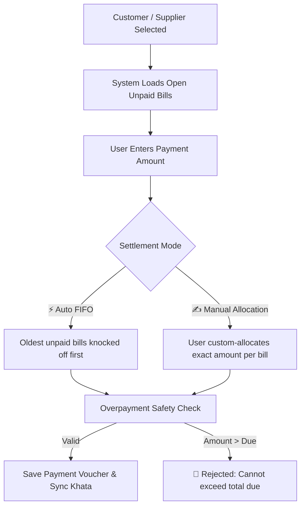

# 📘 WorkSpace Inventory & Khata Bahi — Complete Feature & User Guide

Welcome to the comprehensive user manual and feature guide for **WorkSpace Inventory & Khata Bahi SaaS**. This document details every single feature in the system, explaining **what it is**, **why it matters**, and **step-by-step instructions on how to use it**.

---

## 📑 Table of Contents

1. [System Architecture & Navigation Map](#1-system-architecture--navigation-map)
2. [Authentication & Role-Based Access Control (RBAC)](#2-authentication--role-based-access-control-rbac)
3. [Products & Inventory Catalog Management](#3-products--inventory-catalog-management)
4. [Warehouses & Multi-Godown Storage](#4-warehouses--multi-godown-storage)
5. [Stock In / Stock Out & Commercial Billing Integration](#5-stock-in--stock-out--commercial-billing-integration)
6. [Customer Directory & Receivables Khata](#6-customer-directory--receivables-khata)
7. [Supplier Directory & Payables Khata](#7-supplier-directory--payables-khata)
8. [Bill-Wise Payments & Knockoff Engine (FIFO & Manual Allocation)](#8-bill-wise-payments--knockoff-engine-fifo--manual-allocation)
9. [Financial Safety & Overpayment Prevention](#9-financial-safety--overpayment-prevention)
10. [Khata Bahi (Party Ledger Statements & Printing)](#10-khata-bahi-party-ledger-statements--printing)
11. [Executive Financial KPIs & Daily Cashflow Analytics](#11-executive-financial-kpis--daily-cashflow-analytics)
12. [Vouchers History & Audit Trail](#12-vouchers-history--audit-trail)
13. [End-to-End Practical How-To Guides](#13-end-to-end-practical-how-to-guides)

---

## 1. System Architecture & Navigation Map

WorkSpace Inventory is built as a **multi-tenant enterprise SaaS platform** with strict tenant data isolation, sub-ledger accounting, and real-time inventory synchronization.

### 🌐 Module Sitemap

| Page / Route | Purpose | Key Actions |
|---|---|---|
| [`index.html`](file:///c:/Users/moham/OneDrive/Desktop/imp/work%20company/src/frontend/index.html) | Secure Login & SaaS Gateway | Login, Tenant Context Switching, Session Management |
| [`inv-products.html`](file:///c:/Users/moham/OneDrive/Desktop/imp/work%20company/src/frontend/inv-products.html) | Product Catalog & Live Stock | Add Product, Edit, Quick Stock (+/-), Batch Tracking |
| [`inv-warehouses.html`](file:///c:/Users/moham/OneDrive/Desktop/imp/work%20company/src/frontend/inv-warehouses.html) | Multi-Godown Management | Add Warehouse, View Godown Stock, Capacity Monitoring |
| [`inv-customers.html`](file:///c:/Users/moham/OneDrive/Desktop/imp/work%20company/src/frontend/inv-customers.html) | Customer Directory & CRM | Add Customer, GSTIN / Address, View Customer Khata |
| [`inv-suppliers.html`](file:///c:/Users/moham/OneDrive/Desktop/imp/work%20company/src/frontend/inv-suppliers.html) | Supplier / Vendor Directory | Add Supplier, Bank Details, Payment Terms, Khata |
| [`inv-payments.html`](file:///c:/Users/moham/OneDrive/Desktop/imp/work%20company/src/frontend/inv-payments.html) | Payments, Khata Bahi & KPIs | Receive Payment, Pay Supplier, FIFO Knockoff, Statements |

---

## 2. Authentication & Role-Based Access Control (RBAC)

### 🔑 What It Is
Every user belongs to a specific company/tenant. Access is gated by permissions mapped to specific organizational roles.

### 👥 System Roles

* **`super_admin`**: Full system control across tenants and billing.
* **`company_admin`**: Full administrative access within the tenant (manage users, inventory, billing, settings).
* **`inventory_manager`**: Can create/edit products, manage godowns, and record stock movements.
* **`accountant`**: Manages payments, invoices, bills, party statements, and financial reports.
* **`warehouse_staff`**: Performs daily Stock In and Stock Out adjustments.
* **`sales_executive`**: Manages customers and creates sales stock-out entries.
* **`viewer`**: Read-only access to catalogs and reports.

### 📋 How to Use
1. Open [`http://localhost:5000/index.html`](http://localhost:5000/index.html).
2. Enter your Email (e.g., `admin@acme.com`) and Password (`Password@123`).
3. Click **Sign in to WorkSpace**. The JWT token is securely saved in `localStorage` and sent with all API requests.

---

## 3. Products & Inventory Catalog Management

### 📦 What It Is
The central master database for all inventory items, supporting standard retail, wholesale, batch-tracked, and perishable goods.

### ⚙️ Product Specifications
* **SKU / Barcode**: Unique identification code for scanning and tracking.
* **Category & Unit**: Classification (e.g., Electronics, Hardware) and measuring unit (`Pcs`, `Kg`, `Box`, `Mtr`).
* **Pricing Levels**: MRP (Maximum Retail Price), Purchase Rate (Cost Price), and Default Selling Price.
* **Indian Tax Compliance**: HSN Code and GST Rate percentage (`0%`, `5%`, `12%`, `18%`, `28%`).
* **Inventory Control**: Reorder Threshold Alert (highlights items that are running low).
* **Tracking Modes**: `STANDARD` (quantity only) or `BATCH` (supports Batch Numbers and Expiry Dates).

### 📋 How to Use
1. Navigate to **Inventory Catalog** ([`inv-products.html`](file:///c:/Users/moham/OneDrive/Desktop/imp/work%20company/src/frontend/inv-products.html)).
2. Click **➕ Add Product**.
3. Fill in the product details:
   * **Name**: e.g., `HDMI Cable 1.5m`
   * **SKU**: e.g., `ELEC-HDMI-15`
   * **Category & Unit**: Select from dropdowns.
   * **Purchase Rate & Selling Price**: Enter prices (e.g., ₹250 purchase, ₹499 selling).
   * **GST Rate**: Select tax bracket (e.g., `18%`).
   * **Reorder Level**: e.g., `20` (system warns when total stock drops below 20).
4. Click **Save Product**.

---

## 4. Warehouses & Multi-Godown Storage

### 🏭 What It Is
Multi-location inventory tracking across central warehouses, regional godowns, distribution hubs, and retail stores.

### 📋 How to Use
1. Open **Warehouses & Godowns** ([`inv-warehouses.html`](file:///c:/Users/moham/OneDrive/Desktop/imp/work%20company/src/frontend/inv-warehouses.html)).
2. Click **➕ Add Warehouse**.
3. Enter Name (`Main Godown - Bhiwandi`), Code (`WH-BHW`), Location (`Mumbai, MH`), and Total Capacity.
4. Click **Save Warehouse**.
5. Live stock across all warehouses is automatically summed on the products page and tracked per-warehouse in the Stock Ledger.

---

## 5. Stock In / Stock Out & Commercial Billing Integration

### ⚡ What It Is
A unified transaction engine that updates physical stock counts in real time while optionally generating commercial accounting documents (**Invoices** for Customers or **Purchase Bills** for Suppliers).

### 🔄 Movement Types

#### 1. Stock In (`+`) — Purchase / Restocking
* Increases inventory count in the selected godown.
* If a **Supplier** is attached:
  * Creates a **Supplier Purchase Bill** (`BILL-YYYY-XXXX`).
  * If marked **Unpaid / Credit**: Adds to Supplier Payables.
  * If marked **Paid / Partial**: Records immediate `PAYMENT_OUT` voucher and updates remaining bill balance.

#### 2. Stock Out (`-`) — Sales / Dispatch
* Decreases inventory count after validating sufficient stock.
* If a **Customer** is attached:
  * Creates a **Tax Sales Invoice** (`INV-YYYY-XXXX`).
  * If marked **Unpaid / Credit**: Adds to Customer Receivables.
  * If marked **Paid / Partial**: Records immediate `PAYMENT_IN` voucher and updates remaining invoice balance.

### 📋 How to Use (Quick Stock)
1. On **Products Page** ([`inv-products.html`](file:///c:/Users/moham/OneDrive/Desktop/imp/work%20company/src/frontend/inv-products.html)), find any product and click **⚡ Stock**.
2. Select **Movement Type**:
   * `Stock In (+)` for receiving inventory from a vendor.
   * `Stock Out (-)` for selling/dispatching inventory to a buyer.
3. Select the **Warehouse / Godown**.
4. Enter **Quantity** and **Unit Rate**.
5. *(Optional Batch Tracking)* If enabled on product, enter **Batch Number** and **Expiry Date**.
6. Under **Commercial Billing**:
   * Select the **Supplier** or **Customer**.
   * Review Total Bill Amount (auto-calculated with GST).
   * Choose **Payment Status**:
     * `Credit / Unpaid`: Bill remains open for future settlement.
     * `Full Paid`: Creates voucher immediately; balance = ₹0.
     * `Partial Paid`: Enter initial payment amount (e.g. ₹5,000); remaining balance stays open.
7. Click **Apply & Save**. Stock count, ledger entry, and billing records update simultaneously.

---

## 6. Customer Directory & Receivables Khata

### 👥 What It Is
Complete buyer profile management including GST compliance, credit terms, credit limits, and real-time receivable tracking.

### 📋 Key Fields
* **Business Name & Contact Person**
* **GSTIN & State Code** (used for B2B tax compliance)
* **Payment Terms (Credit Days)**: e.g., 15 Days (triggers automatic overdue aging)
* **Credit Limit (₹)**: Maximum credit exposure allowed for this customer.
* **Billing & Shipping Address**

### 📋 How to Use
1. Open **Customers** ([`inv-customers.html`](file:///c:/Users/moham/OneDrive/Desktop/imp/work%20company/src/frontend/inv-customers.html)).
2. Click **➕ Add Customer**.
3. Fill in Customer Name, Phone, Email, GSTIN, and Credit Terms.
4. Click **Save Customer**.

---

## 7. Supplier Directory & Payables Khata

### 🏭 What It Is
Vendor master directory storing payment terms, bank account details (for NEFT/RTGS payouts), and outstanding payable balances.

### 📋 How to Use
1. Open **Suppliers** ([`inv-suppliers.html`](file:///c:/Users/moham/OneDrive/Desktop/imp/work%20company/src/frontend/inv-suppliers.html)).
2. Click **➕ Add Supplier**.
3. Enter Vendor Name, Contact Info, GSTIN, Payment Terms (e.g. 30 Days), and Bank Details (Account No, IFSC, Bank Name).
4. Click **Save Supplier**.

---

## 8. Bill-Wise Payments & Knockoff Engine (FIFO & Manual Allocation)

### 💰 What It Is
A professional dual-mode settlement engine for recording money received from customers or paid to suppliers.

### ⚙️ How It Works



### ⚡ Settlement Modes

1. **⚡ Auto-Knockoff (FIFO)**:
   * Click the **⚡ Auto-Knockoff (FIFO)** button.
   * The algorithm automatically allocates funds against the oldest unpaid invoices/bills first until the payment amount is exhausted.
   * Partial settlements are applied to the active bill, leaving the exact remaining balance displayed.

2. **✍️ Manual Allocation**:
   * Type exact amounts into the **Allocate (₹)** inputs next to specific bill rows.
   * The remaining bill balance updates live in green (`₹0` when cleared) or blue (remaining balance).

3. **💳 Supported Payment Modes**:
   * **📱 UPI**: Captures 12-digit UTR / RRN (GPay, PhonePe, Paytm, BHIM).
   * **🏦 NEFT / RTGS / IMPS**: Captures Bank Transaction UTR.
   * **📝 Cheque**: Captures 6-digit Cheque Number & Bank Name.
   * **💵 Cash**: Captures Cash Receipt Reference with statutory compliance notice.
   * **🌐 Net Banking**: Captures Net Banking Reference ID.

### 📋 How to Record a Payment / Receipt
1. Open **Payments & Khata Bahi** ([`inv-payments.html`](file:///c:/Users/moham/OneDrive/Desktop/imp/work%20company/src/frontend/inv-payments.html)).
2. Click **➕ Record Payment** (or click **💵 Receive** / **💸 Pay** on any row).
3. Select **Party Type** (`Customer` or `Supplier`) and select the **Party Name**.
4. The system immediately loads:
   * Total outstanding due.
   * Table of open unpaid bills with voucher numbers, dates, and pending amounts.
5. Enter **Total Payment Amount (₹)**.
6. Choose settlement method:
   * Click **⚡ Auto-Knockoff (FIFO)** for automatic priority settlement.
   * OR enter custom allocation amounts in the bill table.
7. Select **Payment Mode** and enter **UTR / Reference Number**.
8. Click **Save & Update Khata**.

---

## 9. Financial Safety & Overpayment Prevention

### 🛡️ What It Is
Hard financial validation barriers preventing data corruption, negative balances, and erroneous cash entries.

### 🔒 Active Safeguards

1. **Party Total Due Cap**: You cannot enter or submit a payment amount greater than the party's total outstanding balance.
2. **Zero-Balance Block**: If a party is already `CLEARED` (₹0 due), recording further payments is blocked.
3. **Bill-Level Allocation Cap**: You cannot allocate more money to an individual bill than its remaining pending amount.
4. **Total Allocation Consistency**: The sum of all manual bill allocations cannot exceed the total payment amount.
5. **Stock Adjustment Overpayment Block**: When recording partial payments during Quick Stock, `paidAmount` cannot exceed `totalAmount`.
6. **Live UI Alerts**: Instant red highlight and warning message if an entered value exceeds allowable limits.

---

## 10. Khata Bahi (Party Ledger Statements & Printing)

### 📜 What It Is
An authentic digital replica of the traditional Indian **खाता बही (Khata Bahi)** ledger, showing running debit/credit balances for any customer or supplier.

### 📊 Statement Columns
* **Date**: Transaction timestamp.
* **Voucher #**: Clickable voucher identifier (`INV-...`, `BILL-...`, `REC-...`, `PAY-...`).
* **Transaction Type**: Invoices, Bills, Receipts, Payments, Opening Balances.
* **Payment Mode / Reference**: UPI UTR, NEFT Reference, Cheque Number.
* **Debit (₹)**: Value charged / paid out.
* **Credit (₹)**: Value billed / received in.
* **Running Balance (₹)**: Net position after each entry with Dr/Cr status.

### 📋 How to View & Print Statement
1. In [`inv-payments.html`](file:///c:/Users/moham/OneDrive/Desktop/imp/work%20company/src/frontend/inv-payments.html), click **📜 Statement** next to any customer or supplier.
2. Filter by date range if desired (From Date — To Date).
3. Review total debits, total credits, and net closing balance.
4. Click **🖨️ Print Statement** for a clean, print-optimized statement suitable for sharing with clients or accountants.

---

---

## 11. Executive Financial KPIs & Daily Cashflow Analytics

### 📈 What It Is
Real-time dashboard cards providing immediate visibility into company liquidity, credit risk, and daily collections.

### 🎯 Key Performance Indicators (KPIs)

* **Total Receivables (₹)**: Total money owed to your company by customers across all open invoices.
* **Total Payables (₹)**: Total money your company owes to suppliers across all open purchase bills.
* **Overdue Receivables (₹)**: Value of customer invoices that have passed their credit terms / due date.
* **Net Working Capital (₹)**: Net operational balance (`Total Receivables − Total Payables`).
* **Cash in Hand (₹)**: Store physical cash drawer net position (`Cash Inflows − Cash Outflows`).
* **Bank / UPI Balance (₹)**: Net liquid capital in corporate bank accounts, UPI VPAs, and digital gateways.

### 📅 Daily Payment & Cashflow Tracker
* Aggregates collections (Inflow) and vendor disbursements (Outflow) per day for the last 30 days.
* Displays mode-wise distribution (UPI vs NEFT vs Cash vs Cheque).
* Displays Net Daily Cashflow (`Inflow − Outflow`), incorporating both commercial trading and outside cashflow entries.

---

## 12. Outside Cash Flow & Account Balance Adjustments

### ⚡ What It Is
Allows merchants, store managers, and admins to **add to (+ Inflow)** or **subtract from (- Outflow)** store cash and bank balances without distorting commercial trade sales or purchase ledger outstandings.

### 📂 Supported Non-Trading Categories

| Flow Direction | Purpose | Supported Categories | Target Liquidity Impact |
| :--- | :--- | :--- | :--- |
| ➕ **Add to Balance** <br>*(Outside Inflow)* | Capital injection or non-commercial cash in | • **Owner / Partner Capital Injection** (`CAPITAL_INJECTION`)<br>• **Loan / Borrowing Inflow** (`LOAN_RECEIVED`)<br>• **Other Income / Inflow** (`OTHER_INFLOW`) | Increases **Cash in Hand** or **Bank / UPI** balance |
| ➖ **Subtract from Balance** <br>*(Outside Outflow)* | Drawings, overheads, or non-commercial cash out | • **Owner Drawings / Personal Drawings** (`OWNER_DRAWINGS`)<br>• **Store / Office Rent & Utilities** (`RENT_AND_UTILITIES`)<br>• **Staff Salary & Wages** (`SALARY_AND_WAGES`)<br>• **Office & Store Expenses** (`OFFICE_EXPENSES`)<br>• **Loan Repayment / EMI** (`LOAN_REPAYMENT`)<br>• **Bank Charges & Processing Fee** (`BANK_CHARGES_TAX`)<br>• **Other Outflow** (`OTHER_OUTFLOW`) | Decreases **Cash in Hand** or **Bank / UPI** balance |

### 📋 How to Use
1. On the **Inventory Dashboard** ([`inv-dashboard.html`](file:///c:/Users/moham/OneDrive/Desktop/imp/work%20company/src/frontend/inv-dashboard.html)) or **Payments Screen** ([`inv-payments.html`](file:///c:/Users/moham/OneDrive/Desktop/imp/work%20company/src/frontend/inv-payments.html)), click **`⚡ Outside Cash Flow / Adjust Balance`**.
2. Select **➕ Add to Balance** (green) or **➖ Subtract from Balance** (red).
3. Choose the target account: **💵 Cash in Hand** or **🏛️ Bank / UPI**.
4. Enter the amount to view the **Live Impact Preview** (e.g., `+₹50,000 will be ADDED to Cash in Hand as Outside Inflow`).
5. Select category, transaction date, particulars / entity name, and reference/UTR number.
6. Click **✓ Record Outside Flow**. The account balances and daily cashflow will update immediately.

---

## 13. Vouchers History & Multi-Type Filtering

### 📑 What It Is
A comprehensive chronological log of all commercial documents (`INVOICE`, `BILL`, `PAYMENT_IN`, `PAYMENT_OUT`, `OUTSIDE_INFLOW`, `OUTSIDE_OUTFLOW`, `OPENING_BAL`).

### 🔍 Quick-Filter Pills
* ⭐ **All Records (41)**: Complete unified ledger of all issued documents and payment entries.
* 📄 **Sales Invoices (12)**: Tax invoices issued to commercial and retail customers.
* 🧾 **Purchase Bills (10)**: Inward inventory purchase bills from distributors.
* ➕ **Collections In (11)**: Customer payment receipts.
* ➖ **Payments Out (8)**: Supplier payment vouchers.
* ⚡ **Outside Cashflow**: Capital injections, drawings, rent, and overhead expenses.
* ⚖️ **Opening / Capital**: Initial carry-forward balances.

### 📋 How to Use
1. Open [`inv-payments.html`](file:///c:/Users/moham/OneDrive/Desktop/imp/work%20company/src/frontend/inv-payments.html) and click the **📑 All Vouchers & Bills** tab (or click **`📈 Sales Invoices →`** / **`📥 Purchase Bills →`** directly from the dashboard Retail Trading card).
2. Click any quick-filter pill or select from the **Document Type** dropdown.
3. Click **🔍 Voucher #** or **🧾 View** on any row to open the complete printable document with line items, tax breakdown, and linked settlement history.

---

## 14. End-to-End Practical How-To Guides

### 🛍️ Workflow A: Complete Customer Sales & Receipt Flow

```
Step 1: Create Product (HDMI Cable, ₹250 cost, ₹499 sell)
  ↓
Step 2: Stock Out to Customer on Credit (Qty: 10, Total: ₹4,990, Status: UNPAID)
  → Creates Invoice INV-2627-0020
  → Customer Outstanding becomes ₹4,990 | Status: CURRENT
  ↓
Step 3: Receive Partial Payment (₹2,000 via UPI)
  → Click "Receive" on Customer row
  → Enter ₹2,000, Click "⚡ Auto-Knockoff (FIFO)"
  → Bill INV-2627-0020 remaining balance: ₹2,990
  → Customer Outstanding becomes ₹2,990 | Status: CURRENT (NOT CLEARED)
  ↓
Step 4: Receive Final Settlement (₹2,990 via NEFT)
  → Click "Receive" on Customer row
  → Enter ₹2,990, Click "⚡ Auto-Knockoff (FIFO)"
  → Bill INV-2627-0020 marked PAID
  → Customer Outstanding becomes ₹0 | Status: CLEARED ✅
  ↓
Step 5: View Khata Statement
  → Statement shows Invoice (₹4,990 Dr) + Receipt 1 (₹2,000 Cr) + Receipt 2 (₹2,990 Cr)
  → Net Closing Balance: ₹0
```

---

### 🏭 Workflow B: Complete Vendor Purchase & Payment Flow

```
Step 1: Stock In from Supplier on Credit (Qty: 50, Rate: ₹800, Total: ₹40,000, Status: UNPAID)
  → Creates Purchase Bill BILL-2627-0025
  → Supplier Payable becomes ₹40,000 | Status: CURRENT
  ↓
Step 2: Pay Vendor Partial (₹15,000 via NEFT)
  → Click "Pay" on Supplier row
  → Enter ₹15,000, Click "⚡ Auto-Knockoff (FIFO)"
  → Bill BILL-2627-0025 remaining balance: ₹25,000
  → Supplier Payable becomes ₹25,000 | Status: CURRENT (NOT CLEARED)
  ↓
Step 3: Pay Vendor Balance (₹25,000 via Cheque)
  → Click "Pay" on Supplier row
  → Enter ₹25,000, Click "⚡ Auto-Knockoff (FIFO)"
  → Bill BILL-2627-0025 marked PAID
  → Supplier Payable becomes ₹0 | Status: CLEARED ✅
  ↓
Step 4: View Khata Statement
  → Statement shows Bill (₹40,000 Cr) + Payment 1 (₹15,000 Dr) + Payment 2 (₹25,000 Dr)
  → Net Closing Balance: ₹0
```

---

## 14. Initial Working Capital & Baseline Capital Fund

### 💼 What It Is
Allows businesses to configure an initial capital baseline (e.g. ₹5,00,000 owner equity or seed fund) so Net Working Capital calculations accurately reflect total financial capacity:

$$\text{Net Working Capital} = \text{Initial Capital Baseline} + \text{Total Customer Receivables} - \text{Total Supplier Payables}$$

### 📋 How to Set / Adjust
1. On **Payments & Khata** ([`inv-payments.html`](file:///c:/Users/moham/OneDrive/Desktop/imp/work%20company/src/frontend/inv-payments.html)), click the **Net Working Capital** card (or click **💼 Set Initial Working Capital** on the Dashboard).
2. Enter the **Initial Capital Amount (₹)** (e.g., `500000`).
3. *(Optional)* Check **"Also record as Cash / Bank Capital Inflow Voucher"** if this capital was physically deposited into Cash in Hand or Bank/UPI.
4. Review the **Live Working Capital Formula Preview**:
   `Base Capital (₹5,00,000) + Receivables (₹99,970) − Payables (₹5,20,000) = +₹79,970`
5. Click **✓ Save Working Capital**. All KPI cards and dashboard summaries update instantly.

---

## 🎯 Summary

All modules operate under a **single source of truth** with automated synchronization:
* Adding stock on credit immediately registers in **Receivables / Payables**.
* Recording payments knocks off specific bills using **FIFO or custom allocation**.
* Outside cash flows allow adjusting **Cash in Hand** and **Bank Liquidity** cleanly without affecting trade debts.
* Initial Working Capital allows businesses to establish **baseline capital funds** for accurate solvency metrics.
* Partial payments maintain exact pending amounts and **prevent premature clearing**.
* Financial safety barriers prevent **overpayment or paying more than total due**.
* Khata statements provide an **audit-ready financial history** for every business party.
* User-registered tenant accounts and custom transactions are **100% permanently retained** across demo reseeds.
